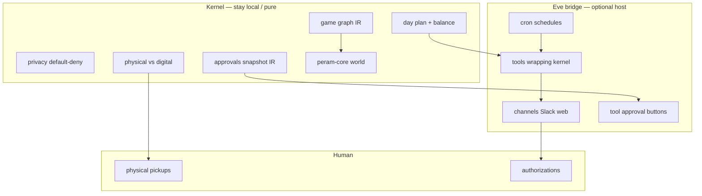

# Vercel Eve fit map — ensembly / Game of Peram

**Audience:** Operator · implementer · agents  
**Sources:** [vercel.com/eve](https://vercel.com/eve) · [Introducing eve](https://vercel.com/blog/introducing-eve) · [eve.dev docs](https://eve.dev/docs/introduction) (schedules, tools/HITL, channels)  
**Contract:** [PRIVACY.md](PRIVACY.md) stays supreme — Eve never becomes the home of full persona or finance/medical vaults.  
**Related:** [arch-design/coming-next.md](arch-design/coming-next.md) SN-5 · [SWARM-DESIGN.md](SWARM-DESIGN.md)

*Last updated: 2026-07-13*

---

## 0. One-sentence verdict

**Eve is the optional cloud bridge** for **operator channels, remote approve/deny, and cron-fired day digests** — not a rewrite of the local life-swarm kernel or the Game of Peram WASM world.

---

## 1. What Eve is (capability inventory)

| Eve primitive | What it is | Evidence (product) |
|---------------|------------|--------------------|
| **Channels** | Same agent on Slack, Discord, Teams, web chat, WhatsApp, API, … | Multi-channel delivery; `channels/*.ts` |
| **Tool approval (HITL)** | `approval: always()` / policy; session **parks** until human signs off | Tools + human-in-the-loop docs |
| **Schedules** | Cron files under `schedules/`; markdown task or `run` + `receive(channel)` | Schedules → Vercel Cron |
| **Durable sessions** | Workflow-backed pause/resume across deploys | Durable execution / Workflow SDK |
| **Sandbox** | Isolated VM for agent code/files | Vercel Sandbox |
| **Connections** | OAuth/MCP tools without model seeing secrets | Connect + `connections/` |
| **Subagents** | Specialist directories under `subagents/` | Delegation |
| **Evals / traces** | CI gate + OTel run replay | Observability |

---

## 2. ensembly surfaces → Eve fit



| Project concern | Today (ensembly) | Eve solves? | How |
|-----------------|------------------|-------------|-----|
| **User communication** (notify, chat, “what should I do?”) | CLI `swarm turn`, static `public/watch`, game HUD | **Yes — primary fit** | `channels/slack.ts` (etc.): post physical queue + pending list; answer operator questions with **redacted** tools only |
| **Remote control / approval** | CLI `approve` / `deny` + local JSON snapshot; game A/D keys | **Yes — primary fit** | Wrap side-effect tools with `approval: always()`; Slack approve/reject buttons; durable park until resolved |
| **Schedules** (morning plan, weekly digest) | Manual `npm run swarm:day`; schedule section *inside* plan markdown | **Yes — primary fit** | `schedules/morning-plan.md` cron → run plan tool → `receive(slack, …)` with turn digest |
| **Day prioritization / balance / privacy classify** | Pure `src/day.js`, `privacy.js`, `loop.js` | **No as rewrite** | Eve **calls** kernel via tool or CLI; logic stays pure + unit-tested |
| **Physical realm pickups** | `src/realm.js` + turn surface | **Partial** | Eve **surfaces** the list on a channel; cannot do the body-world work |
| **Idle wait snapshot IR** | `src/approvals.js` | **Map, don’t replace blindly** | Eve durable pause ≈ our `idle_waiting`; keep snapshot JSON as portable IR or dual-write adapter |
| **Game of Peram / WASM world** | `public/game`, `crates/peram-core` | **No** | Local/browser (later desktop) sim; Eve is not a game engine |
| **Full private persona / medical / finance** | `private/` gitignored | **Refuse on Eve cloud** | Tools must receive **projections** only; never upload vault to sandbox by default |
| **Multiplayer watch room** | Roadmap SN-6 | **Partial** | Shared channel + session stream ≠ immersive world; can notify “focus changed” only |

---

## 3. Decision matrix (adopt / adapt / refuse)

| Pattern | Decision | Why |
|---------|----------|-----|
| Slack (or web) **turn digest** + chat Q&A | **Adopt** | Removes “must be at laptop CLI” friction for communication |
| Remote **approve/deny** of external mutations | **Adopt** | Matches product bar: digital automates, human grants auth; Eve parks free of compute |
| Cron **morning plan / evening review** | **Adopt** | Schedules are first-class; maps to day loop cadence |
| Tools that shell `node bin/swarm.js …` or import pure modules | **Adapt** | Bridge pattern: Eve owns I/O + durability; kernel stays Node pure |
| Snapshot events ↔ Eve approval sessions | **Adapt (SN-5)** | Documented adapter; optional dual-write |
| Rewrite looper/day/privacy into Eve instructions only | **Refuse** | Loses unit tests, privacy audit trail, offline dogfood |
| Host full `private/persona` inside Eve sandbox on Vercel | **Refuse** | Privacy contract + sovereignty gist |
| Put WASM game sim on Eve schedules | **Refuse** | Wrong abstraction |

---

## 4. Concrete bridge sketch (not implemented yet)

Filesystem-shaped Eve agent (conceptual):

```text
agent/
  instructions.md          # “You are the ensembly bridge; never request private vault”
  agent.ts
  tools/
    run_day_plan.ts        # calls pure day loop / CLI; returns public sections only
    list_operator_turn.ts  # physical + pending from snapshot
    apply_approval.ts      # approval: always() — maps to approve/deny IR
    export_graph_summary.ts
  channels/
    slack.ts               # primary remote operator surface
  schedules/
    morning-turn.md        # cron: fire digest to Slack
    evening-review.md
  skills/
    privacy-redaction.md
    physical-first.md
```

**Approval mapping**

| ensembly | Eve |
|----------|-----|
| `pending[]` + `status: idle_waiting` | Gated tool call parked mid-session |
| `node bin/swarm.js approve <id>` | Channel button / web approval UI |
| `node bin/swarm.js deny <id>` | Reject path; resume with deny outcome |
| Game A/D keys | Stay local host; optional webhook to same IR |

**Schedule mapping**

| ensembly cadence | Eve schedule idea |
|------------------|-------------------|
| Daily plan assembly | `0 7 * * *` UTC (or local via careful cron) → day tool → Slack |
| HITL nag for stale pending | `0 12,18 * * *` → list pending → channel |
| Weekly graph summary | Monday cron → graph summary |

**Communication mapping**

| Need | Eve channel |
|------|-------------|
| “What’s my physical queue?” | Slack/web message → `list_operator_turn` |
| “Approve auth-x” | Approval UI on gated tool |
| Incident / reminder push | Schedule `receive(slack, …)` |

---

## 5. Privacy & sovereignty constraints (non-negotiable)

1. **Default-deny travels with the tool boundary** — Eve tools return classified-public summaries; classifier still `src/privacy.js`.
2. **No full persona in Eve repo or sandbox** unless a future local-only Eve host is proven; cloud Eve gets projections.
3. **Secrets** via Connect / env — model never sees tokens (Eve connection model).
4. **Idempotent side effects** — Eve re-runs interrupted steps; gate email/calendar/git with approval + idempotency keys.
5. **Offline kernel still works** without Eve (`npm run swarm:*`, `npm run game`).

---

## 6. What stays iron-peak without Eve

| Iron-peak | Path |
|-----------|------|
| Day loop + balance | `src/day.js`, `src/loop.js` |
| Privacy classify | `src/privacy.js` |
| Realm + turn | `src/realm.js`, `src/turn.js` |
| Approvals IR | `src/approvals.js` |
| Graph IR | `src/graph.js` |
| Game world | `src/game/*`, `crates/peram-core`, `public/game/*` |

Eve is a **host adapter**, same altitude as “optional Stately adapter” — never the kernel.

---

## 7. Production sequence (no prototype theater)

This is a **production bridge**, not a throwaway spike. Ship thin vertical slices that are **real for daily life**, privacy-reviewed, tested, and reversible — not demos you delete.

| Step | Work | Production gate |
|------|------|-----------------|
| 1 | Fit map + charter (docs) | Done — this file + [PRODUCT-CHARTER.md](PRODUCT-CHARTER.md) + [AGENTS.md](../AGENTS.md) |
| 2 | `bridge/eve/` (in-repo) or monorepo app with **redacted-only** fixtures and CI | `eve eval` / typecheck green; privacy checklist on every tool output |
| 3 | **One** production channel (Slack *or* web) + `list_operator_turn` | Operator gets a true physical+pending digest they use for real days |
| 4 | Morning + evening **schedules** posting that digest | Cron fires in prod; empty/failure paths loud |
| 5 | Gated tools: approve/deny mapped to approvals IR (dual-write) | Durable park; reject path; idempotent; never auto-mutate bank/email |
| 6 | Optional: draft-only external tools behind approval | Still no unattended send |
| 7 | SN-6 multiplayer only after remote turn is *lived* for real | Scope lock |

**Bar:** if the operator would not trust it with a real pending authorization, it is not “done enough to merge.”

---

## 8. Scorecard (fit confidence)

| Area | Eve fit grade | Confidence |
|------|---------------|------------|
| User communication | **A** | 85% |
| Remote approve/deny | **A** | 85% |
| Schedules / cron digests | **A** | 80% |
| Durable wait (cloud) | **A−** | 75% |
| Kernel rewrite | **F** (refuse) | 90% |
| Private vault host | **F** (refuse) | 95% |
| Game WASM immersion | **D** (notify only) | 80% |

---

## 9. References

| Source | Use |
|--------|-----|
| [Introducing eve](https://vercel.com/blog/introducing-eve) | Product shape, HITL, schedules, channels |
| [eve.dev Introduction](https://eve.dev/docs/introduction) | Directory layout |
| [Schedules](https://eve.dev/docs/schedules) | Cron + `receive` channel handoff |
| [Tools](https://eve.dev/docs/tools) | `approval` helpers |
| [PRIVACY.md](PRIVACY.md) | Push / cloud boundary |
| [sovereignty-gist](../public/thinking/sovereignty-gist.md) | Local control + ZDR posture |

---

**Footer plain rule:** Eve talks to the human and waits for yes/no; ensembly kernel still decides what is physical, private, and planned. Build the bridge for real life — production-grade, not a hobby demo.
