# Coming next — ensembly (Game of Peram)

**Audience:** Operator · implementer · agents  
**Style:** Short words. Diagrams over prose. Optimism grounded in evidence.  
**Contract:** [PRIVACY.md](../PRIVACY.md) · [SWARM-DESIGN.md](../SWARM-DESIGN.md) · [DECISIONS.md](../DECISIONS.md)  
**Method:** stellar-roadmap · fusion-sage · ai-optimization · higher-order-decision-architect · looper

*Last updated: 2026-07-13*

---

## 0. Mission (one sentence)

Remove digital friction so the swarm automates curate/plan/classify while the operator only picks up **physical world** work and grants **approvals** — and can watch the agent play the **Game of Peram** as a graph.

---

## 0b. Ten-year thrive picture (2036 — not survival, ascent)

Tailwinds: local-first agents, Stately-style durable HITL resume, human-in-the-loop product patterns (Eve approvals), graph viz as shared situational awareness.

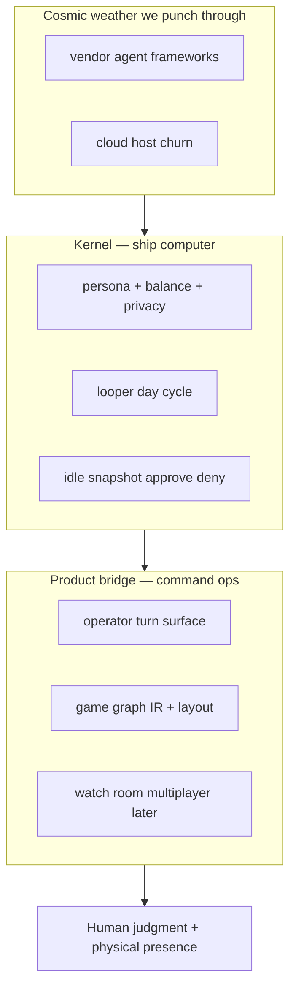

| 2036 role | What it is | Why it still wins |
|-----------|------------|-------------------|
| **Kernel** | Pure prioritize/balance/privacy/loop + durable wait snapshots | Host-agnostic; testable; privacy default-deny |
| **Bridge** | Turn surface, graph play view, optional Eve/Stately adapters | Swap renderers; keep iron-peak state machine |
| **Boundary** | Physical pickups + explicit approve/deny only | Human energy is scarce; agents do digital chores |

**Design bet:** Kernel forever = harmonious life-state control plane. Today’s renderer (CLI/markdown/HTML) is disposable. Multiplayer voice room is ascent, not a side quest to abandon.

---

## 1. Scorecard — what landed (swarm MVP → game altitude)

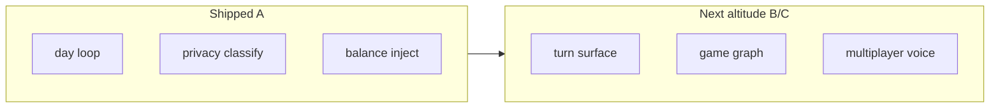

| Area | Grade | One line | Evidence |
|------|-------|----------|----------|
| Day self-org plan | A | Projects/Actions/Schedule from persona | `src/day.js`, `npm run swarm:day` |
| Privacy default-deny | A | Finance/medical private; pushable gated | `src/privacy.js`, `test/privacy.test.js` |
| Looper phases/budgets | A | ORIENT→…→DONE with budgets | `src/loop.js`, `test/loop.test.js` |
| Public/private persona split | A | Full local, projection public | `public/persona/`, `private/` gitignored |
| Physical pickup queue | B→ | Realm tag + turn lists physical | `src/realm.js`, `src/turn.js` |
| Durable approve/deny | B→ | Idle snapshot resume | `src/approvals.js` |
| Game graph watch | B→ | Nodes/edges + mermaid/HTML | `src/graph.js`, `public/watch/` |
| Eve / multiplayer voice | C | Documented only | §0b + SN-5/6; Non-goals near-term |

**Plain rule:** Digital automates; human touches physical world + authorizations.

---

## 2. System map (today + target)

```mermaid
flowchart TB
  persona[Persona public or private]
  state[Local state JSON]
  day[Day loop buildDayPlan]
  realm[Realm physical vs digital]
  priv[Privacy classify]
  snap[Wait snapshot HITL]
  turn[Operator turn]
  graph[Game graph IR]
  watch[Watch mermaid or HTML]
  persona --> day
  state --> day
  day --> realm
  day --> priv
  day --> snap
  realm --> turn
  snap --> turn
  day --> graph
  snap --> graph
  graph --> watch
  turn -->|approve deny| snap
```

**Fused abstraction:** *Game of Peram control plane* = day plan + realm split + idle-snapshot approvals + exportable graph. Trace: `src/day.js`, `src/approvals.js`, `src/graph.js`.

---

## 3. Operator data-flow (friction kill)

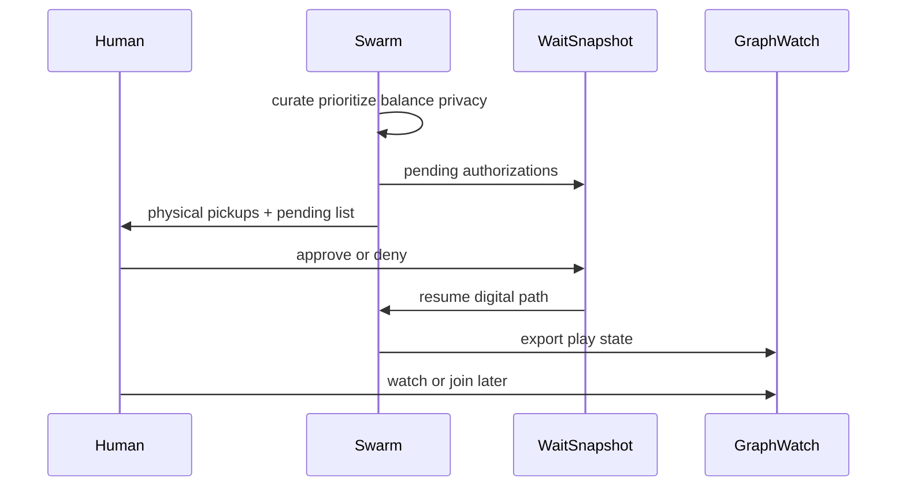

| Layer | Owns | Must not |
|-------|------|----------|
| Day loop | Digital plan assembly | External mutate without HITL |
| Turn surface | Physical queue + approval UI/CLI | Hide pending gates in prose only |
| Snapshot | Durable legal events | Lose wait state across sessions |
| Graph | Shared situational awareness | Require full multiplayer runtime day one |
| Privacy | Default-deny private paths | Commit `private/` |

---

## 4. Musk five-step — applied to backlog

| Step | Question | Verdict |
|------|----------|---------|
| 1. Requirements | What must human still do? | Physical presence + approve/deny only |
| 2. Delete | What digital friction dies? | Manual prioritization, rediscovering HITL in long plans |
| 3. Simplify | One turn command | `swarm turn` surfaces both queues |
| 4. Accelerate | Graph export pure + tested | No layout peer required for IR |
| 5. Automate | Day loop already ships | Keep; attach snapshot + graph |

---

## 5. Trajectory forces (evidence-weighted)

| Force | P(horizon) | Effect on us | Response | Confidence |
|-------|------------|--------------|----------|------------|
| Stately agent HITL idle resume | high | Pattern for durable wait | Mirror snapshot events; optional adapter later | 75% |
| Vercel Eve approvals / fs agent | med | Productized human gates | Pattern only until SN chooses Eve | 60% |
| Graph viz (`@statelyai/graph`) | med | Play-view polish | IR first; layout peer optional | 70% |
| Voice multiplayer rooms | med | Watch + join | SN backlog; not gate MVP | 55% |
| Privacy regulation / family data | high | Leak cost extreme | Default-deny + ignore + classifier | 90% |

**Acceleration trigger:** When operator uses `swarm turn` daily for a week, invest in watch room + optional Eve/Stately adapters — do not shrink autonomy pillars.

---

## 6. Trajectory guardrails

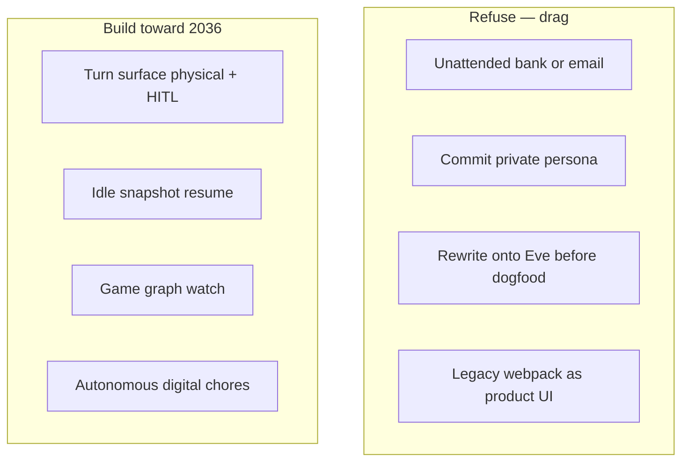

| Refuse | Build toward |
|--------|----------------|
| 24/7 unattended external mutate | Background digital work with HITL gates |
| Defeatist “game pillar dies” | Game of Peram as north-star play surface |
| Scope-creep multiplayer first | Dogfood day+turn+graph before voice room |

---

## 7. Blueprint cards SN-*

### SN-1 · Dogfood gate (no new product surface)

**Problem:** Agents expand scope before the day path is still green.

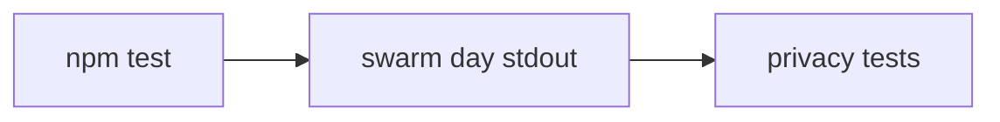

| File | Work |
|------|------|
| `package.json` | keep scripts |
| `test/*` | green |

**Done when:** `npm test` pass; day plan still has Projects/Actions/Schedule.

**Verify:** `npm test && npm run swarm:day:stdout | head`

---

### SN-2 · Physical vs digital realm + pickups

**Problem:** Operator cannot see what only a body in the physical world can do.

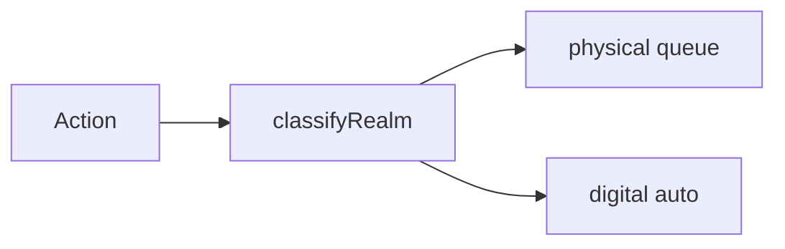

| File | Work |
|------|------|
| `src/realm.js` | physical/digital classify |
| `src/turn.js` | list physical pickups |
| `fixtures/*` | physical-tagged samples |

**Done when:** Turn surface lists ≥1 physical item when state includes physical actions.

**Verify:** `node bin/swarm.js turn --fixture fixtures/state-sample.json`

---

### SN-3 · Durable approve/deny idle snapshot

**Problem:** HITL was only flags in a plan, not a resumable wait state.

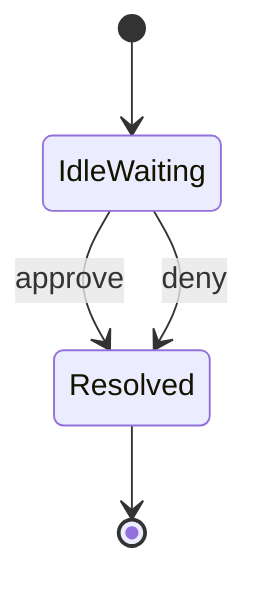

| File | Work |
|------|------|
| `src/approvals.js` | snapshot create/apply |
| `bin/swarm.js` | `approve` / `deny` / `turn` |
| `fixtures/wait-snapshot.json` | sample |

**Done when:** Approve/deny changes pending queue status on disk/JSON snapshot.

**Verify:** turn → approve id → turn shows advanced status.

---

### SN-4 · Game graph export + watch

**Problem:** Cannot watch the agent “play” as nodes/edges.

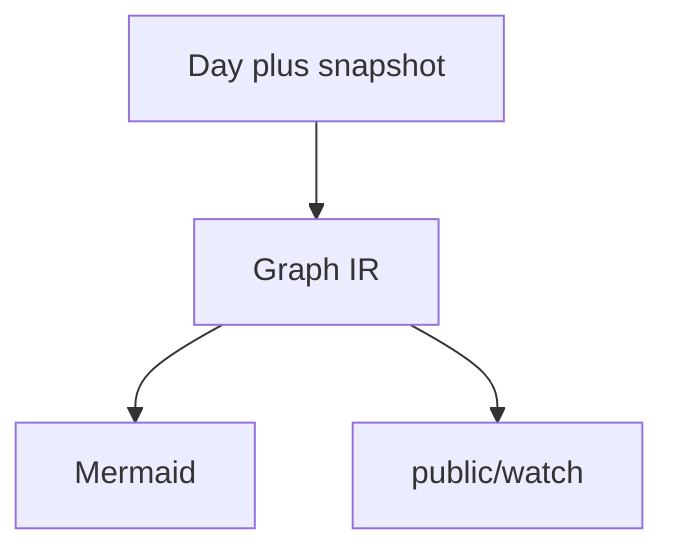

| File | Work |
|------|------|
| `src/graph.js` | nodes/edges export |
| `public/watch/` | simple viewer |
| `test/graph.test.js` | shipped path |

**Done when:** Graph has phase/action nodes + edges; test passes; optional HTML exists.

**Verify:** `node bin/swarm.js graph --stdout`

---

### SN-5 · Optional Stately / Eve adapters (later)

**Problem:** Want industry HITL patterns without rewrite thrash.

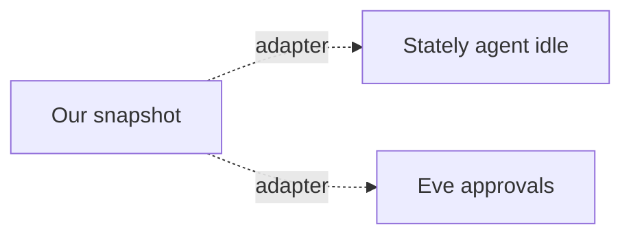

| File | Work |
|------|------|
| `docs/arch-design/*` | contracts only until chosen |

**Done when:** Documented mapping of snapshot events ↔ Stately/Eve; no forced runtime.

**Verify:** Doc review; no broken day path.

---

### SN-6 · Multiplayer watch room + voice (ascent)

**Problem:** Operator wants to join, instruct by voice, while agent backgrounds chores.

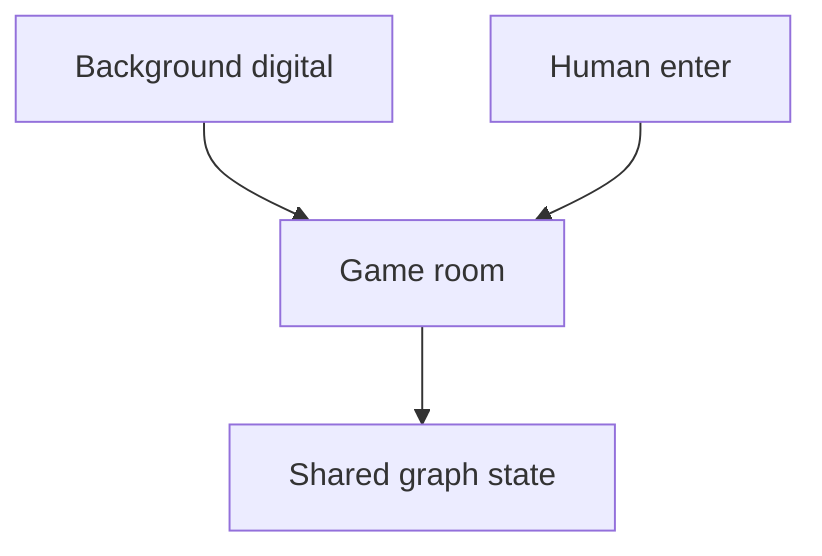

| File | Work |
|------|------|
| backlog only | realtime + voice | 

**Done when:** Separate goal; graph IR already multiplayer-ready shape.

**Verify:** Future goal plan.

---

## 8. Scope lock

| Locked in | Deferred |
|-----------|----------|
| Day plan automation | Full Eve init |
| Physical + approval turn | Voice multiplayer |
| Graph IR + mermaid/HTML | `@statelyai/graph` layout peers required |
| Privacy default-deny | Live bank/email |

---

## 9. Gantt sprint order

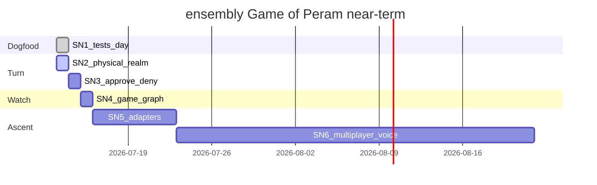

---

## 10. Monitoring signals

| Signal | Healthy | Act |
|--------|---------|-----|
| `npm test` | green | Fix before features |
| Turn physical count | matches tagged actions | Fix realm classifier |
| Pending after approve | decreases | Fix snapshot apply |
| Day plan sections | present | Fix day path |
| Private in git status | never | Fix gitignore |

---

## 11. Done log

| When | What |
|------|------|
| 2026-07-12 | Swarm MVP: day loop, privacy, persona split, looper global |
| 2026-07-13 | Tag `v0.1.0` at legacy tip; this roadmap + turn/graph altitude |

---

## 12. File touch mindmap

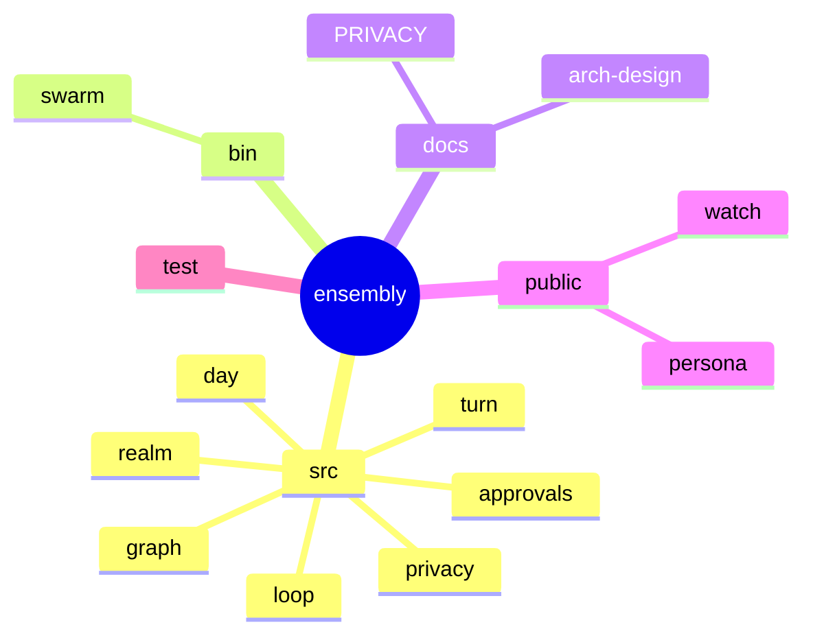

---

## 13. References

| Source | Use |
|--------|-----|
| [Stately agent docs (next)](https://github.com/statelyai/agent/tree/next/docs) | HITL / durable agent patterns |
| [Stately graph package](https://stately.ai/docs/packages/graph) | Graph IR inspiration |
| [Stately graph layout](https://stately.ai/docs/packages/graph/layout) | Layout adapters later |
| [Vercel Eve](https://vercel.com/eve) | Filesystem agent + approval UX inspiration |
| [looper skill](~/.grok/skills/looper/SKILL.md) | Outer loop budgets/phases |
| [PRIVACY.md](../PRIVACY.md) | Push boundary |
| [SWARM-DESIGN.md](../SWARM-DESIGN.md) | Day cycle iron-peak |

---

**Footer plain rule:** Automate the digital; surface the physical; wait only for explicit permission.
