# Coming next — ensembly (Game of Peram)

**Audience:** Operator · implementer · agents  
**Style:** Short words. Diagrams over prose. Optimism grounded in evidence.  
**Contract:** [PRIVACY.md](../PRIVACY.md) · [SWARM-DESIGN.md](../SWARM-DESIGN.md) · [DECISIONS.md](../DECISIONS.md)  
**Method:** stellar-spacemap · fusion-sage · ai-optimization · higher-order-decision-architect · control-graph  
**Quest:** [uncertainty-space-quest.md](../thinking/uncertainty-space-quest.md) — *space is the new-era ocean*

*Last updated: 2026-07-30*

---

## 0. Mission (one sentence)

Remove digital friction so the swarm automates curate/plan/classify while the operator only picks up **physical world** work and grants **approvals** — navigates **uncertain space** without trauma — and plays the **Game of Peram** as a truthful, engaging world. **Production life infrastructure** (see [PRODUCT-CHARTER.md](../PRODUCT-CHARTER.md), [AGENTS.md](../../AGENTS.md)) — not a hobby demo.

---

## 0b. Ten-year thrive picture (2036 — not survival, ascent)

Tailwinds: local-first agents, Stately-style durable HITL resume, human-in-the-loop product patterns (Eve approvals), graph viz as shared situational awareness.

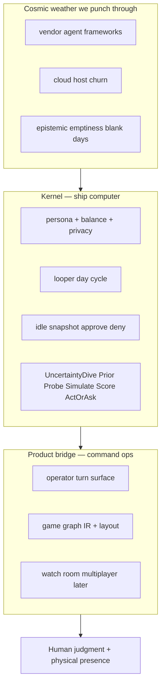
```mermaid
flowchart TB
  subgraph kernelY["Kernel — ship computer"]
    K1[persona + balance + privacy]
    K2[looper day cycle]
    K3[idle snapshot approve deny]
    K4[UncertaintyDive Prior Probe Simulate Score ActOrAsk]
  end
  subgraph bridgeY["Product bridge — command ops"]
    B1[operator turn surface]
    B2[game graph IR + layout]
    B3[watch room multiplayer later]
  end
  subgraph weather["Cosmic weather we punch through"]
    W1[vendor agent frameworks]
    W2[cloud host churn]
    W3[epistemic emptiness blank days]
  end
  weather --> kernelY
  kernelY --> bridgeY
  bridgeY --> OUT[Human judgment + physical presence]
```

| 2036 role | What it is | Why it still wins |
|-----------|------------|-------------------|
| **Kernel** | Pure prioritize/balance/privacy/loop + durable wait snapshots + **dive into uncertain space** | Host-agnostic; testable; privacy default-deny; trauma-light process under no data |
| **Bridge** | Turn surface, graph play view, optional Eve/Stately adapters | Swap renderers; keep iron-peak state machine |
| **Boundary** | Physical pickups + explicit approve/deny only (Auth = black hole) | Human energy is scarce; agents do digital chores |

**Design bet:** Kernel forever = harmonious life-state control plane that can **jump into uncertain space with a tether** (Prior→Probe→Simulate→Score→ActOrAsk). Today’s renderer (CLI/markdown/HTML) is disposable. Multiplayer voice room is ascent, not a side quest to abandon.

---

## 1. Scorecard — what landed (swarm MVP → game altitude)

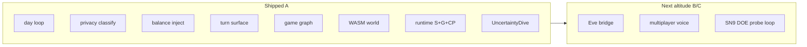
```mermaid
flowchart LR
  subgraph shipped["Shipped A"]
    D[day loop]
    P[privacy classify]
    B[balance inject]
    T[turn surface]
    G[game graph]
    W[WASM world]
    R[runtime S+G+CP]
    Dive[UncertaintyDive]
  end
  subgraph open["Next altitude B/C"]
    E[Eve bridge]
    M[multiplayer voice]
    Doe[SN9 DOE probe loop]
  end
  shipped --> open
```

| Area | Grade | One line | Evidence |
|------|-------|----------|----------|
| Day self-org plan | A | Projects/Actions/Schedule from persona | `src/day.js`, `npm run swarm:day` |
| Privacy default-deny | A | Finance/medical private; pushable gated | `src/privacy.js`, `test/privacy.test.js` |
| Looper phases/budgets | A | ORIENT→…→DONE with budgets | `src/loop.js`, `test/loop.test.js` |
| Public/private persona split | A | Full local, projection public | `public/persona/`, `private/` gitignored |
| Physical pickup queue | A− | Realm tag + turn lists physical | `src/realm.js`, `src/turn.js` |
| Durable approve/deny | A− | Idle snapshot resume | `src/approvals.js` |
| Game graph watch | A− | Nodes/edges + mermaid/HTML | `src/graph.js`, `public/watch/` |
| Life-mirror play graph | A− | Beacons from real next physical/auth; game loads life-graph first | `src/play.js`, `public/game/life-graph.json`, `test/play.test.js` |
| life-os portfolio projection | A− | Cards → candidates; finance private | `src/lifeos/`, `test/lifeos-portfolio.test.js` |
| Digital-flow bill_pay / Bank | A− | HITL + dry-run execute; deny no-run | `src/digital-flow.js`, `swarm digital-flow`, `test/digital-flow.test.js` |
| **Rust kernel restart** | B+ | Control SoT moves to `peram-kernel`; T1 SQLite + sealed backup + vault seal | `crates/peram-kernel`, `cargo test -p peram-kernel`, `peram` CLI |
| **Issue #1 HITL/HOOTL runtime** | A− | S+G+CP+P, MsgBus, triggers, HOOTL agents, AuthGate/PhysicalBeacon; game excluded | `runtime load\|status\|tick\|approve\|claim\|complete`, `fixtures/issue-1-runtime.json`, [DECISIONS](../DECISIONS.md#issue-1-hitlhootl-runtime-core-2026-07-24) |
| **UncertaintyDive (space navigator)** | A− | Inspect Prior→Probe→Simulate→Score→ActOrAsk; Auth black hole; trauma guards; no mutate | `uncertainty_dive.rs`, `runtime dive`, [quest](../thinking/uncertainty-space-quest.md), [DECISIONS](../DECISIONS.md#uncertaintydive--process-under-epistemic-emptiness-2026-07-30) |
| Immersive game world | A− | Env/sprites/props + WASM focus SoT | `public/game/`, `crates/peram-core`, `npm run game` |
| Eve bridge map | B | Fit doc: channels/HITL/schedules only | [EVE-FIT.md](../EVE-FIT.md), SN-5 |
| Multiplayer voice room | C | Ascent only | SN-6 |
| DOE closed-loop probe | C | Dive inspects; tick does not yet shrink duration spans | SN-9 |

**Plain rule:** Digital automates; human touches physical world + authorizations; blank days → dive into uncertain space with a tether.

---

## 2. System map (today + target)

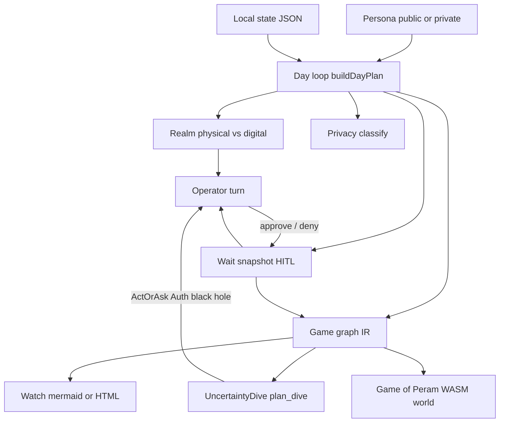
```mermaid
flowchart TB
  persona[Persona public or private]
  state[Local state JSON]
  dayLoop[Day loop buildDayPlan]
  realm[Realm physical vs digital]
  priv[Privacy classify]
  snap[Wait snapshot HITL]
  turn[Operator turn]
  graphIR[Game graph IR]
  dive[UncertaintyDive plan_dive]
  watchUI[Watch mermaid or HTML]
  playWorld[Game of Peram WASM world]
  persona --> dayLoop
  state --> dayLoop
  dayLoop --> realm
  dayLoop --> priv
  dayLoop --> snap
  realm --> turn
  snap --> turn
  dayLoop --> graphIR
  snap --> graphIR
  graphIR --> dive
  graphIR --> watchUI
  graphIR --> playWorld
  turn -->|"approve / deny"| snap
  dive -->|"ActOrAsk Auth black hole"| turn
```

**Fused abstraction:** *Game of Peram control plane* = day plan + realm split + idle-snapshot approvals + exportable graph + playable world + **UncertaintyDive** (navigate uncertain space). Trace: `src/day.js`, `src/approvals.js`, `src/graph.js`, `src/game/`, `public/game/`, `crates/peram-kernel/src/uncertainty_dive.rs`.

---

## 3. Operator data-flow (friction kill)

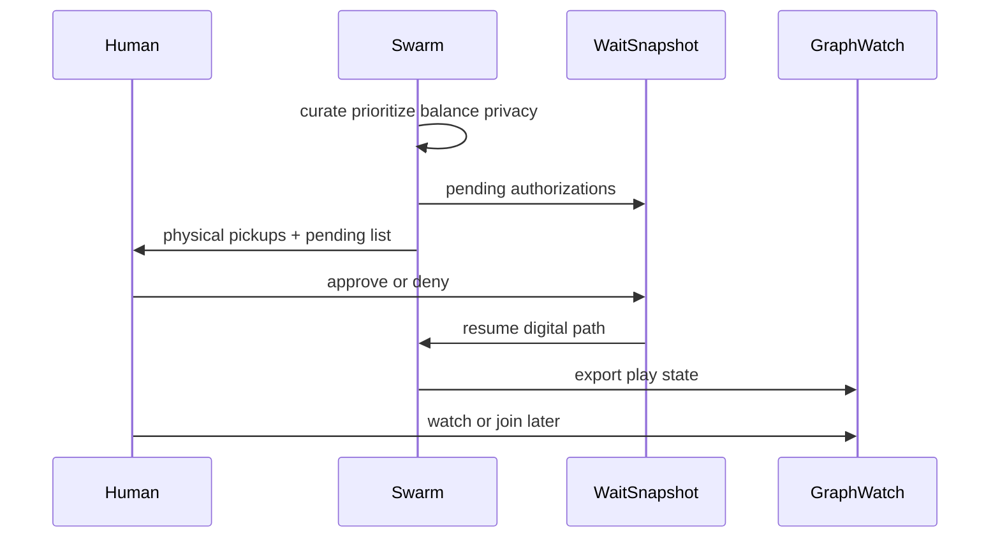
```mermaid
sequenceDiagram
  participant H as Human
  participant S as Swarm
  participant W as WaitSnapshot
  participant G as GraphWatch
  S->>S: curate prioritize balance privacy
  S->>W: pending authorizations
  S->>H: physical pickups + pending list
  H->>W: approve or deny
  W->>S: resume digital path
  S->>G: export play state
  H->>G: watch or join later
```

| Layer | Owns | Must not |
|-------|------|----------|
| Day loop | Digital plan assembly | External mutate without HITL |
| Turn surface | Physical queue + approval UI/CLI | Hide pending gates in prose only |
| Snapshot | Durable legal events | Lose wait state across sessions |
| Graph | Shared situational awareness | Require full multiplayer runtime day one |
| Privacy | Default-deny private paths | Commit `private/` |

---

## 4. Musk five-step — applied to backlog

| Step | Question | Verdict |
|------|----------|---------|
| 1. Requirements | What must human still do? | Physical presence + approve/deny only |
| 2. Delete | What digital friction dies? | Manual prioritization, rediscovering HITL in long plans |
| 3. Simplify | One turn command | `swarm turn` surfaces both queues |
| 4. Accelerate | Graph export pure + tested | No layout peer required for IR |
| 5. Automate | Day loop already ships | Keep; attach snapshot + graph |

---

## 5. Trajectory forces (evidence-weighted)

| Force | P(horizon) | Effect on us | Response | Confidence |
|-------|------------|--------------|----------|------------|
| Stately agent HITL idle resume | high | Pattern for durable wait | Mirror snapshot events; optional adapter later | 75% |
| Vercel Eve channels + approvals + schedules | high | Remote comms / HITL / cron digests | Bridge only; see EVE-FIT — not kernel rewrite | 85% |
| Graph viz (`@statelyai/graph`) | med | Play-view polish | IR first; layout peer optional | 70% |
| Voice multiplayer rooms | med | Watch + join | SN backlog; not gate MVP | 55% |
| Privacy regulation / family data | high | Leak cost extreme | Default-deny + ignore + classifier | 90% |
| Epistemic emptiness / blank days | high | Classical rank fails with sparse data | UncertaintyDive process; active DOE (SN-9) | 80% |

**Acceleration trigger:** When operator uses `swarm turn` daily for a week, invest in watch room + optional Eve/Stately adapters — do not shrink autonomy pillars. When `runtime dive` is the morning habit on blank days, close the DOE loop (SN-9) before more inference theater.

---

## 6. Trajectory guardrails

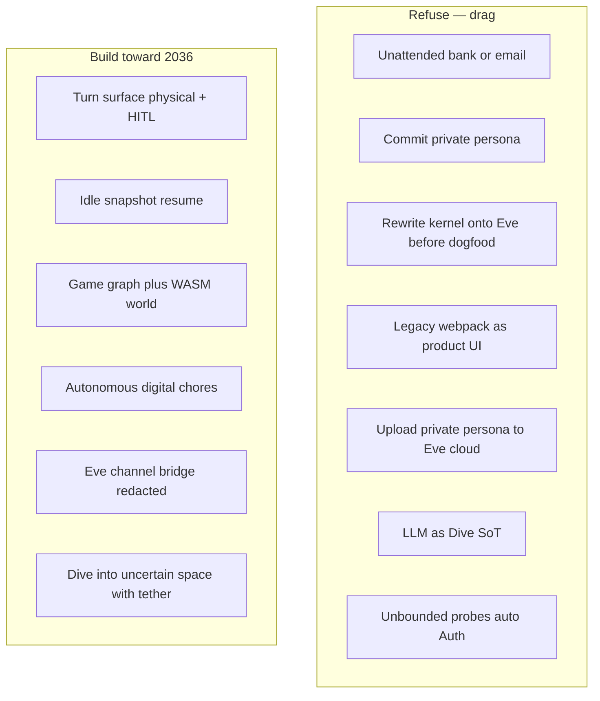
```mermaid
flowchart TD
  subgraph avoid["Refuse — drag"]
    A1[Unattended bank or email]
    A2[Commit private persona]
    A3[Rewrite kernel onto Eve before dogfood]
    A4[Legacy webpack as product UI]
    A5[Upload private persona to Eve cloud]
    A6[LLM as Dive SoT]
    A7[Unbounded probes auto Auth]
  end
  subgraph build["Build toward 2036"]
    B1[Turn surface physical + HITL]
    B2[Idle snapshot resume]
    B3[Game graph plus WASM world]
    B4[Autonomous digital chores]
    B5[Eve channel bridge redacted]
    B6[Dive into uncertain space with tether]
  end
```

| Refuse | Build toward |
|--------|----------------|
| 24/7 unattended external mutate | Background digital work with HITL gates |
| Defeatist “game pillar dies” | Game of Peram as north-star play surface |
| Scope-creep multiplayer first | Dogfood day+turn+graph+game before voice room |
| Eve as persona vault | Eve as channel + approval + schedule bridge |
| LLM decides dive / auto Auth | Inspect `runtime dive` + trauma guards; Auth = black hole |
| Ocean-drown metaphor as product law | **Space-era** navigation: void, black hole, tether, EVA |

---

## 7. Blueprint cards SN-*

### SN-0 · Issue #1 remaining (after runtime core)

**Problem:** Essentials-first S+G+CP+MsgBus+HITL shipped; scale/telemetry/remote still open.

| Remaining | Why it waits |
|-----------|--------------|
| Multi-agent conflict at scale | Basic claim-via-CP agents work; contention policies not production |
| Adaptive / RL local policies | Formal deferred until essentials solid |
| Continuous Correctness/Effectiveness/Efficiency dashboards | Status counters only today |
| Eve remote HITL | Bridge trajectory; local MsgBus first |

**Shipped evidence:** [DECISIONS Issue #1](../DECISIONS.md#issue-1-hitlhootl-runtime-core-2026-07-24) · `cargo test -p peram-kernel` · `fixtures/issue-1-runtime.json`

**Verify:** `cargo run -p peram-kernel -- runtime load --fixture fixtures/issue-1-runtime.json && cargo run -p peram-kernel -- runtime tick`

---

### SN-1 · Dogfood gate (no new product surface)

**Problem:** Agents expand scope before the day path is still green.

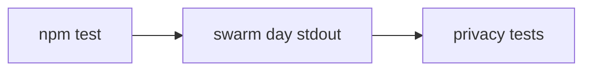
```mermaid
flowchart LR
  test[npm test] --> day[swarm day stdout]
  day --> priv[privacy tests]
```

| File | Work |
|------|------|
| `package.json` | keep scripts |
| `test/*` | green |

**Done when:** `npm test` pass; day plan still has Projects/Actions/Schedule.

**Verify:** `npm test && npm run swarm:day:stdout | head`

---

### SN-2 · Physical vs digital realm + pickups

**Problem:** Operator cannot see what only a body in the physical world can do.

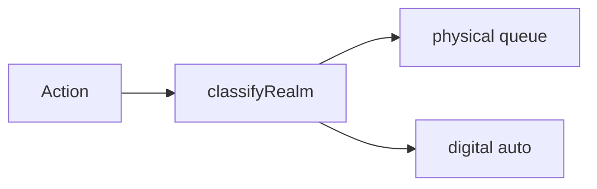
```mermaid
flowchart LR
  action[Action] --> realm[classifyRealm]
  realm --> phys[physical queue]
  realm --> dig[digital auto]
```

| File | Work |
|------|------|
| `src/realm.js` | physical/digital classify |
| `src/turn.js` | list physical pickups |
| `fixtures/*` | physical-tagged samples |

**Done when:** Turn surface lists ≥1 physical item when state includes physical actions.

**Verify:** `node bin/swarm.js turn --fixture fixtures/state-sample.json`

---

### SN-3 · Durable approve/deny idle snapshot

**Problem:** HITL was only flags in a plan, not a resumable wait state.

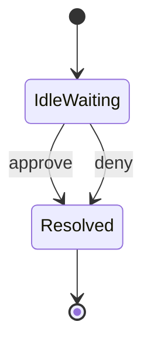
```mermaid
stateDiagram-v2
  [*] --> IdleWaiting
  IdleWaiting --> Resolved: approve
  IdleWaiting --> Resolved: deny
  Resolved --> [*]
```

| File | Work |
|------|------|
| `src/approvals.js` | snapshot create/apply |
| `bin/swarm.js` | `approve` / `deny` / `turn` |
| `fixtures/wait-snapshot.json` | sample |

**Done when:** Approve/deny changes pending queue status on disk/JSON snapshot.

**Verify:** turn → approve id → turn shows advanced status.

---

### SN-4 · Game graph export + watch

**Problem:** Cannot watch the agent “play” as nodes/edges.

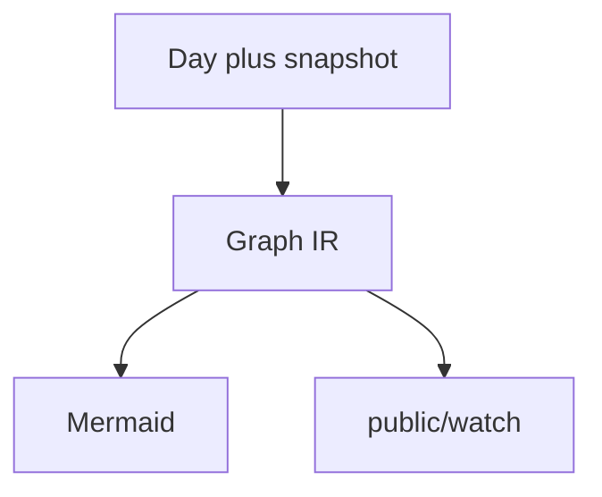
```mermaid
flowchart TB
  state[Day plus snapshot] --> ir[Graph IR]
  ir --> mermaid[Mermaid]
  ir --> html[public/watch]
```

| File | Work |
|------|------|
| `src/graph.js` | nodes/edges export |
| `public/watch/` | simple viewer |
| `test/graph.test.js` | shipped path |

**Done when:** Graph has phase/action nodes + edges; test passes; optional HTML exists.

**Verify:** `node bin/swarm.js graph --stdout`

---

### SN-5 · Eve bridge (channels · remote approval · schedules)

**Problem:** Operator needs **remote communication**, **approve/deny away from CLI**, and **cron digests** without rewriting the kernel or leaking private persona.

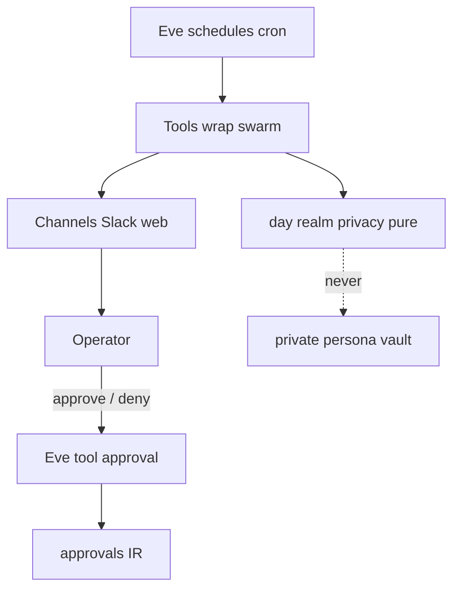
```mermaid
flowchart TB
  sched[Eve schedules cron] --> tools[Tools wrap swarm]
  tools --> ch[Channels Slack web]
  ch --> human[Operator]
  human -->|"approve / deny"| appr[Eve tool approval]
  appr --> ir[approvals IR]
  tools --> kernel[day realm privacy pure]
  kernel -.->|never| vault[private persona vault]
```

| File | Work |
|------|------|
| [docs/EVE-FIT.md](../EVE-FIT.md) | Fit map + production sequence (no prototype theater) |
| [docs/PRODUCT-CHARTER.md](../PRODUCT-CHARTER.md) · [AGENTS.md](../../AGENTS.md) | Binding product law |
| `docs/DECISIONS.md` | Eve host + seriousness decisions |
| `bridge/eve/` (production app) | Channels + tools + schedules; redacted I/O; CI + evals |
| `src/approvals.js` | IR dual-write with Eve approval sessions |

**Adopt on Eve:** channels (user comms), tool `approval` (remote control), `schedules/` (cadence).  
**Keep local:** day/privacy/realm pure functions, WASM game, private vault.  
**Full map:** [EVE-FIT.md](../EVE-FIT.md). **No prototype theater** — production bar from first merge.

**Done when (docs gate — met):** Fit matrix + privacy refuse + production sequence; charter + AGENTS.md.  
**Done when (code gate):** Production channel posts true turn digest; gated approve/deny dual-writes IR; morning/evening cron reliable; privacy checklist green; operator would trust a real auth gate.

**Verify:** `eve eval` + privacy checklist + operator dogfood of real pending items.

---

### SN-6 · Multiplayer watch room + voice (ascent)

**Problem:** Operator wants to join, instruct by voice, while agent backgrounds chores.

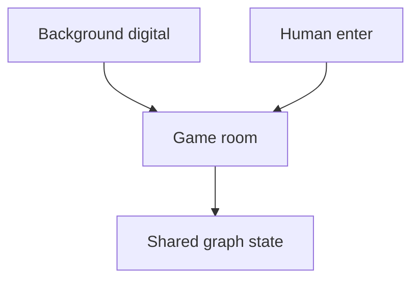
```mermaid
flowchart TB
  bg[Background digital] --> room[Game room]
  human[Human enter] --> room
  room --> collab[Shared graph state]
```

| File | Work |
|------|------|
| backlog only | realtime + voice | 

**Done when:** Separate goal; graph IR already multiplayer-ready shape.

**Verify:** Future goal plan.

---

### SN-7 · Episodic memory (peram-memory) — LANDED 2026-07-29

**Problem:** The swarm forgot everything between CLI runs — no trajectory, no learned patterns, no reflection. IntelliArch prototype had the missing brain stem.

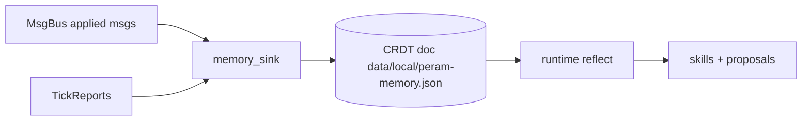
```mermaid
flowchart LR
  bus[MsgBus applied msgs] --> sink[memory_sink]
  ticks[TickReports] --> sink
  sink --> doc[(CRDT doc data/local/peram-memory.json)]
  doc --> reflect[runtime reflect]
  reflect --> skills[skills + proposals]
```

| File | Work |
|------|------|
| `crates/peram-memory` | CRDT trajectory/skills/goals + coherence engine (sync, durable pattern counts) |
| `crates/peram-kernel/src/memory_sink.rs` | Bridge: record applied-only; `runtime reflect` CLI; `--memory/--no-memory` |

**Done when (done):** `cargo test -p peram-memory` (9) · kernel tests green (44) · dogfood load/tick/reflect → durable trajectory · DECISIONS entry landed.

**Verify:** `cargo run -p peram-kernel -- runtime load --fixture fixtures/issue-1-runtime.json && cargo run -p peram-kernel -- runtime tick && cargo run -p peram-kernel -- runtime reflect`

**Law:** memory is aux, never SoT — records what happened, never decides gates/CP.

---

### SN-8 · Inference providers, recall, delegation, tool surface (revised 2026-07-29)

**Problem:** Memory learns but agents act without recall; reflection is Jaccard-only; Grok/Cursor cannot consume memory without a governed MCP export. **Primary bet: official xAI CLI** — [ACP `grok agent stdio`](https://docs.x.ai/build/cli/headless-scripting#acp), [MCP via `grok mcp add`](https://docs.x.ai/build/features/mcp-servers), headless `grok -p --output-format json` for inference. Ollama optional/slow. Deterministic always works offline.

**Official wire (do not invent):**

| Surface | Command / config | Role for ensembly |
|---------|------------------|-------------------|
| Headless prompt | `grok --no-auto-update -p "…" --output-format json` | Fast InferenceProvider enrich |
| ACP agent | `grok --no-auto-update agent stdio` | DelegationBackend / IDE host |
| MCP register | `grok mcp add --scope project peram -- ./target/debug/peram-mcp` | Export memory tools into Grok |
| Project config | `.grok/config.toml` `[mcp_servers.peram]` | Operator generates via `grok mcp add` (gitignored; no secrets) |

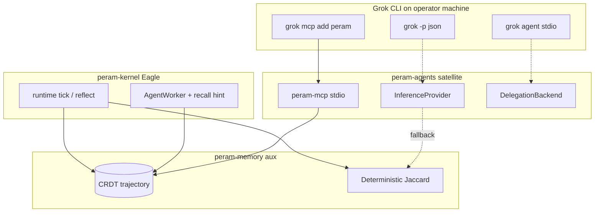
```mermaid
flowchart TB
  subgraph eagle["peram-kernel Eagle"]
    rt[runtime tick / reflect]
    worker[AgentWorker + recall hint]
  end
  subgraph mem["peram-memory aux"]
    doc[(CRDT trajectory)]
    det[Deterministic Jaccard]
  end
  subgraph sat["peram-agents satellite"]
    mcp[peram-mcp stdio]
    inf[InferenceProvider]
    del[DelegationBackend]
  end
  subgraph grokHost["Grok CLI on operator machine"]
    grokMcp["grok mcp add peram"]
    grokAcp["grok agent stdio"]
    grokP["grok -p json"]
  end
  rt --> doc
  rt --> det
  worker --> doc
  mcp --> doc
  grokMcp --> mcp
  grokP -.-> inf
  grokAcp -.-> del
  inf -.->|fallback| det
```

#### Phase table

| Phase | Work | Status |
|-------|------|--------|
| **P2a** | `InferenceProvider` + deterministic; `PERAM_INFERENCE` | shipping this slice |
| **P3a** | AgentWorker claim detail gets `recall_hint` | shipping this slice |
| **P4a** | `peram-mcp` read-only tools + Grok register docs | shipping this slice |
| **P2b** | Wire `grok -p` headless as enrich adapter | stub + argv helpers now; live spawn next |
| **P2c / P3b** | Wire `grok agent stdio` ACP client (init→auth→session/new→prompt) | stubs + official params helpers |
| **P2d** | opencode / Ollama / pi secondary | deferred |
| **P5** | P2P | design-gated |

#### Env

```text
PERAM_INFERENCE=deterministic|grok-mcp|grok-acp|opencode-acp|ollama
PERAM_DELEGATE=none|grok-acp|opencode-acp
PERAM_MEMORY=data/local/peram-memory.json
```

Unavailable provider → stderr `INFERENCE_WARN` + deterministic. Control ops never depend on Grok being up.

#### Verify

```bash
cargo test --workspace
cargo run -p peram-kernel -- runtime reflect
cargo run -p peram-agents --bin peram-mcp   # then: grok mcp add --scope project peram -- …
```

**Guardrail:** Prefer official docs over grok-build internal reverse-RPC details. Project MCP via `.grok/config.toml`; never commit API keys (`XAI_API_KEY` stays env).

---

### SN-9 · UncertaintyDive — closed-loop probe in uncertain space

**Problem:** Inspect dive shipped (PR #7); blank days still do not *shrink* ignorance — duration spans / Empty→Sparse do not update after a probe tick.

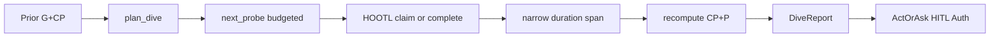
```mermaid
flowchart LR
  prior[Prior G+CP] --> dive[plan_dive]
  dive --> probe[next_probe budgeted]
  probe --> tick[HOOTL claim or complete]
  tick --> update[narrow duration span]
  update --> sim[recompute CP+P]
  sim --> score[DiveReport]
  score --> act[ActOrAsk HITL Auth]
```

| File | Work |
|------|------|
| `crates/peram-kernel/src/uncertainty_dive.rs` | Keep pure inspect; optional `apply_probe_result` IR |
| `crates/peram-kernel/src/runtime.rs` / tick path | After probe tick, update optimistic/pessimistic spans on probed node |
| `fixtures/` | Blank-sheet + sparse-CP fixtures (ARC-style micro) |
| [docs/thinking/uncertainty-space-quest.md](../thinking/uncertainty-space-quest.md) | Quest SoT — space = new-era ocean |

**Shipped (SN-9a — inspect):** `plan_dive` · `runtime dive [--json]` · trauma guards · Auth black hole · [DECISIONS](../DECISIONS.md#uncertaintydive--process-under-epistemic-emptiness-2026-07-30)

**Done when (SN-9b):** One dogfood load→dive→tick→dive shows lower `uncertainty_score` or narrower PERT span on the probed digital CP node; Auth still never auto-approved.

**Verify:**

```bash
cargo test -p peram-kernel uncertainty_dive
cargo run -p peram-kernel -- runtime load --fixture fixtures/issue-1-runtime.json
cargo run -p peram-kernel -- runtime dive --json
```

**Law:** Dive may advise; MsgBus + HITL still own mutation. Memory may enrich Prior only — never gates.

---
## 8. Scope lock

| Locked in | Deferred |
|-----------|----------|
| Day plan automation | Eve production deploy |
| Physical + approval turn + game world | Voice multiplayer room |
| Graph IR + mermaid/HTML + WASM play | `@statelyai/graph` layout peers required |
| Eve fit map + product charter (SN-5 docs) | Eve production bridge (channel + cron + gated approve) |
| Privacy default-deny | Live bank/email; private vault on cloud |
| Production bar (AGENTS.md) | Multiplayer room before remote turn is lived |
| UncertaintyDive inspect (`runtime dive`) | SN-9b DOE closed-loop span update |
| Space-era metaphor (void / black hole / tether) | Ocean framing as product law |

---

## 9. Gantt sprint order

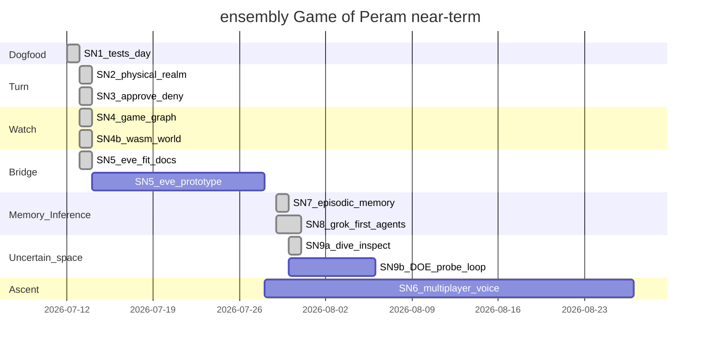
```mermaid
gantt
  title ensembly Game of Peram near-term
  dateFormat YYYY-MM-DD
  section Dogfood
  SN1_tests_day           :done, sn1, 2026-07-12, 1d
  section Turn
  SN2_physical_realm      :done, sn2, 2026-07-13, 1d
  SN3_approve_deny        :done, sn3, 2026-07-13, 1d
  section Watch
  SN4_game_graph          :done, sn4, 2026-07-13, 1d
  SN4b_wasm_world         :done, sn4b, 2026-07-13, 1d
  section Bridge
  SN5_eve_fit_docs        :done, sn5d, 2026-07-13, 1d
  SN5_eve_prototype       :sn5p, 2026-07-14, 14d
  section Memory_Inference
  SN7_episodic_memory     :done, sn7, 2026-07-29, 1d
  SN8_grok_first_agents   :done, sn8, 2026-07-29, 2d
  section Uncertain_space
  SN9a_dive_inspect       :done, sn9a, 2026-07-30, 1d
  SN9b_DOE_probe_loop     :sn9b, 2026-07-30, 7d
  section Ascent
  SN6_multiplayer_voice   :sn6, after sn5p, 30d
```

---

## 10. Monitoring signals

| Signal | Healthy | Act |
|--------|---------|-----|
| `npm test` | green | Fix before features |
| Turn physical count | matches tagged actions | Fix realm classifier |
| Pending after approve | decreases | Fix snapshot apply |
| Day plan sections | present | Fix day path |
| Private in git status | never | Fix gitignore |
| `runtime dive` Auth black hole | surfaces when Auth on CP | Fix `plan_dive` classification |
| Probe budget | ≤ DEFAULT_PROBE_BUDGET | Refuse unbounded EVA |

---

## 11. Done log

| When | What |
|------|------|
| 2026-07-12 | Swarm MVP: day loop, privacy, persona split, looper global |
| 2026-07-13 | Tag `v0.1.0` at legacy tip; turn/graph altitude |
| 2026-07-13 | Immersive game world + WASM focus SoT; `npm run game` |
| 2026-07-13 | Eve fit map: channels/HITL/schedules adopt; kernel refuse rewrite ([EVE-FIT.md](../EVE-FIT.md)) |
| 2026-07-13 | Product charter + AGENTS.md: production-grade life infrastructure; no hobby/prototype theater |
| 2026-07-24 | Issue #1 HITL/HOOTL runtime core in `peram-kernel` (S+G+CP+P, MsgBus, AuthGate/PhysicalBeacon); formal AppGenMathPhyLang |
| 2026-07-29 | Episodic memory (`peram-memory`) + `runtime reflect`; SN-7 |
| 2026-07-29 | SN-8 stretch: Grok-first agents / MCP export (PR #6) |
| 2026-07-30 | Remove dead legacy webpack SPA; Operator CLI retitle |
| 2026-07-30 | UncertaintyDive inspect (`runtime dive`); quest → space-era metaphor (PR #7); SN-9a |

---

## 12. File touch mindmap

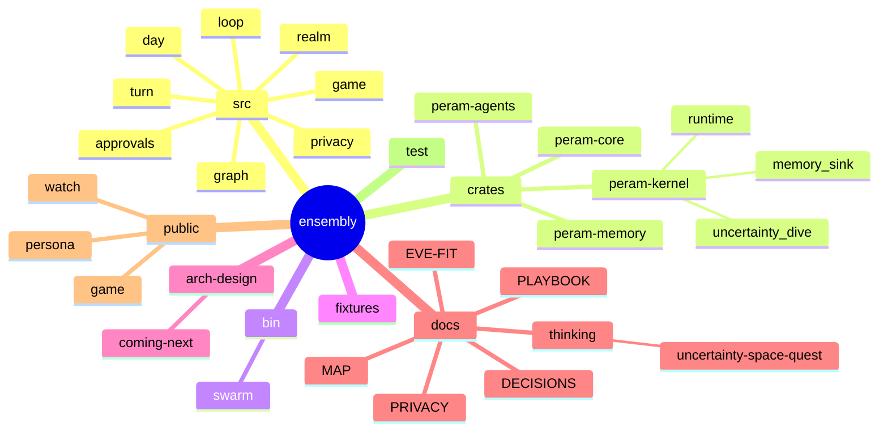
```mermaid
mindmap
  root((ensembly))
    src
      day
      realm
      approvals
      turn
      graph
      privacy
      loop
      game
    crates
      peram-kernel
        uncertainty_dive
        runtime
        memory_sink
      peram-core
      peram-memory
      peram-agents
    bin
      swarm
    fixtures
    arch-design
      coming-next
    docs
      thinking
        uncertainty-space-quest
      EVE-FIT
      PRIVACY
      MAP
      PLAYBOOK
      DECISIONS
    public
      game
      watch
      persona
    test
```

---

## 13. References

| Source | Use |
|--------|-----|
| [Stately agent docs (next)](https://github.com/statelyai/agent/tree/next/docs) | HITL / durable agent patterns |
| [Stately graph package](https://stately.ai/docs/packages/graph) | Graph IR inspiration |
| [Stately graph layout](https://stately.ai/docs/packages/graph/layout) | Layout adapters later |
| [Vercel Eve](https://vercel.com/eve) | Optional bridge: channels, approvals, schedules |
| [EVE-FIT.md](../EVE-FIT.md) | Project decision map adopt/adapt/refuse |
| [Introducing eve](https://vercel.com/blog/introducing-eve) | Product primitives + durable HITL |
| [control-graph skill](~/.cursor/skills/control-graph/SKILL.md) | Outer state / phase budgets |
| [stellar-spacemap skill](~/.cursor/skills/stellar-spacemap/SKILL.md) | This backlog contract |
| [PRIVACY.md](../PRIVACY.md) | Push boundary |
| [SWARM-DESIGN.md](../SWARM-DESIGN.md) | Day cycle iron-peak |
| [uncertainty-space-quest.md](../thinking/uncertainty-space-quest.md) | Epistemic emptiness → Dive process; space = new-era ocean |
| [DECISIONS UncertaintyDive](../DECISIONS.md#uncertaintydive--process-under-epistemic-emptiness-2026-07-30) | Adopt/refuse for dive |

---

**Footer plain rule:** Automate the digital; surface the physical; wait only for explicit permission; jump into uncertain space with a tether — never without trauma guards.
