# Hub constellation — ensembly + satellites

**Audience:** Operator · implementer · agents  
**Style:** Short words. Diagrams over prose. Optimism grounded in evidence.  
**Contract:** [LIFE-OS-BOUNDARY.md](../LIFE-OS-BOUNDARY.md) · [PREMFLOW-FIT.md](../PREMFLOW-FIT.md) · [CLONE-COPILOT.md](../CLONE-COPILOT.md) · [PRIVACY.md](../PRIVACY.md) · [EVE-FIT.md](../EVE-FIT.md) · [DECISIONS.md](../DECISIONS.md)  
**Kernel roadmap (game / runtime SN cards):** [coming-next.md](coming-next.md)  
**Method:** stellar-spacemap · eva-emptiness · higher-order-decision-architect · fusion-sage · control-graph  

*Last updated: 2026-08-12* (priority lock 2→3→1; pain vs build order split; Grok Bot swarm layer)  
*Provenance:* EVA session — hub-not-absorb (A) + cloud-flex modules + XChat bidirectional (host-decrypt, verb-first) + arch-machine groxy NotifyPort + **x.ai Grok Bot as outer swarm**.

---

## 0. Mission (one sentence)

Run **one daily-driver hub** (ensembly) that schedules a **swarm of agents** (local HOOTL + **x.ai/Grok Bots**), automations, and HITL — while satellites keep their SoTs — so personal life work compounds without multi-repo thrash or live-data corruption.

---

## 0b. Ten-year thrive picture (2036 — not survival, ascent)

Tailwinds: local-first kernels, multi-bot cloud teammates, encrypted chat channels, durable HITL resume, redacted cockpits, fixture-gated AgentEx.

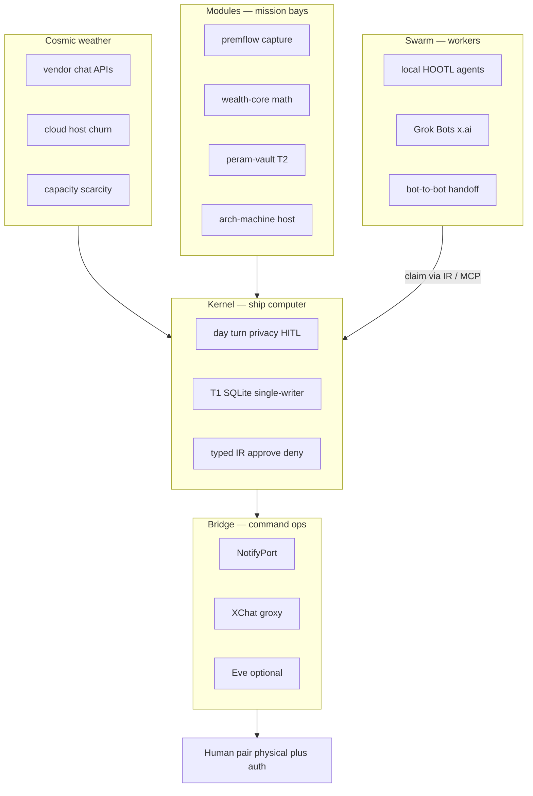

| 2036 role | What it is | Why it still wins |
|-----------|------------|-------------------|
| **Kernel** | ensembly / ensembly-kernel — day, turn, privacy, HITL, schedules | One entry for life ops; testable; offline-capable |
| **Swarm** | Named Grok Bots + local HOOTL — digital chores, handoffs, routines | Parallel workers; human only for body + auth |
| **Modules** | Separate binaries + DBs with typed IR edges | Cloud-deployable pieces; blast radius bounded |
| **Bridge** | NotifyPort + XChat/Eve; redacted only | Swap cockpits; never vault-as-cloud |
| **Boundary** | life-os memory; human pair for body + auth | Capacity is the product constraint |

**Design bet:** Forever = **hub schedules; swarm executes digital work; modules own bytes**. Grok Bot cloud VMs are **workers**, not the life SoT. Today’s channel (XChat vs Eve) is disposable. Mega-repo Life OS is refuse.

---

## 1. Scorecard — constellation readiness

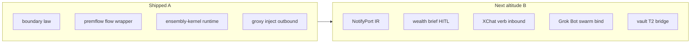

| Area | Grade | One line | Evidence |
|------|-------|----------|----------|
| life-os ≠ ensembly | A | Memory vault vs runtime clone | [LIFE-OS-BOUNDARY.md](../LIFE-OS-BOUNDARY.md) |
| Premflow shared capture | A− | One `~/.premflow/` SoT + `swarm flow` | [PREMFLOW-FIT.md](../PREMFLOW-FIT.md), `npm run flow:link` |
| Clone copilot phase 1 | A− | Propose → PR; no unattended bank | [CLONE-COPILOT.md](../CLONE-COPILOT.md) |
| HITL digital-flow dry-run | A− | Bank path dry-run default | `src/digital-flow.js`, tests |
| ensembly-kernel control | B+ | Runtime S+G+CP; T1 path | `cargo test -p ensembly-kernel` |
| Eve fit map | B | Channels/HITL/schedules adopt | [EVE-FIT.md](../EVE-FIT.md) |
| groxy → XChat outbound | B+ | Host notify shipped | `~/arch-machine/docs/groxy.md`, `bin/groxy inject` |
| **Grok Bot swarm (x.ai)** | C | Product exists; not bound to hub IR yet | [Grok Bot docs](https://docs.x.ai/grok-bot/overview); SN-HUB-7 |
| Wealth → ensembly HITL | C | Math separate; no brief bridge yet | `~/Work/personal/wealth-core` |
| NotifyPort shared IR | C | Concept only (this doc) | SN-HUB-2 |
| XChat inbound verbs | C | Activity+chat-xdk viable; not shipped | SN-HUB-4; groxy SN-GROXY-3 unpark |
| Mega-merge satellites | F (refuse) | Correct refuse | DECISIONS / boundary law |

**Plain rule:** One hub experience; many SoTs; bridges carry IR — never second writers on live ledgers.

---

## 2. System map (today)

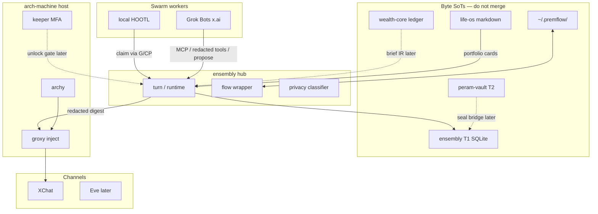

---

## 3. Distance + data-flow law

**Distance scale:** D0 shared SoT · D1 thin adapter · D2 domain satellite · D3 portfolio/presence · D4 craft/park · D5 cold/archive.

| Project | Dist | Port shape | Must not |
|---------|------|------------|----------|
| life-os | D0 projection | Cards/sessions only (memory SoT — not runtime bytes shared with hub) | Merge vault into ensembly git; treat as day/HITL SoT |
| premflow | D0 shared bytes | Keep C CLI; ensembly view | Second todo DB |
| peram-vault | D1 | T2 ciphertext bridge | Eve/Bot plaintext vault |
| **Grok Bot (x.ai)** | **D1–D2** | **Outer swarm** — named bots claim via hub IR / MCP; v1 = one Bot propose; handoffs later | Own day/T1/wealth/premflow SoT; unattended bank/email; upload full persona |
| groxy / arch-machine | D1–D2 | NotifyPort backend + host plane | Become day kernel |
| wealth-core | D2 | Brief → HITL; cues out | Dual-write ledger from hub/chat/bot |
| collab-finder | D2 | Later RO status IR | Write collab DB from ensembly |
| skills / plugins | D1–D2 | AgentEx install into hosts | Own life SoT |
| keeper | D2 | MFA/break-glass only | Substitute for peram-vault |
| devprofile / latex-cv | D3 | Clone-copilot PRs | Hub energy this quarter |
| thepulimaangani / shelf-life / adaptate / elomaxz | D4 | Park | Kernel features |
| ask-grok / grokplans / testskills | D5 | Archive when operator lists | Focus slots |

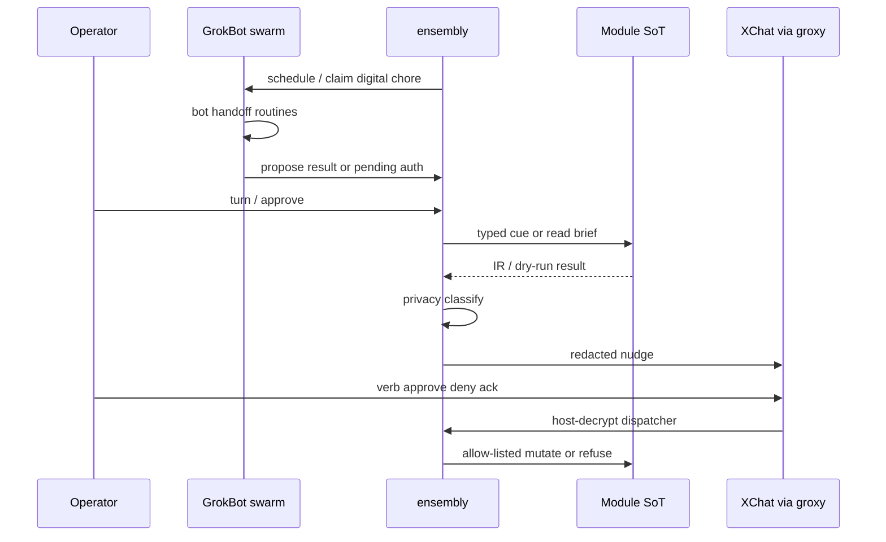

| Layer | Owns | Must not |
|-------|------|----------|
| ensembly kernel | Day, HITL, schedules, **swarm claim graph**; **sole authoritative human inbox** for pending gates | Own wealth math / premflow format / PQ crypto |
| **Grok Bot swarm** | Digital execution, drafts, routines; multi-bot handoffs only after v1 claim works | Life SoT bytes; unattended finance mutate; second approval ledger |
| Module SoT | Its DB/files + domain tests | Accept free PATCH from chat/cloud/bot |
| NotifyPort | Redacted outbound + verb inbound IR | Carry balances/paths/vault plaintext; invent pending state |
| XChat / Eve | Thin remote controller for hub gates (nudge + verbs) | Second todo list or authoritative pending store |
| Cloud bridge | Stateless delivery / cron | Second writer on T1/wealth/premflow |

---

## 4. Musk five-step — applied to backlog

| Step | Question | Verdict |
|------|----------|---------|
| 1 Make requirements less dumb | One hub or one git tree? | **Hub + modules** (A). Absorb = refuse. |
| 2 Delete | Build Eve + XChat + wealth merge at once? | **Delete parallel channel v1** — one NotifyPort backend first. |
| 3 Simplify | Free-form DM → agent? | **Verb-first inbound**; free-form only via registry alias later. |
| 4 Accelerate | Where does live operator pain hit first? | Fixture CI + dry-run before live; groxy inject already exists — reuse. |
| 5 Automate | Schedules / nudges / swarm | After lived-path gate + NotifyPort: **Grok Bots as swarm workers** (claim via IR); inbound verbs; Eve optional |

---

## 5. Trajectory forces (evidence-weighted)

| Force | P(horizon) | Effect | Response | Confidence |
|-------|------------|--------|----------|------------|
| XChat Activity + chat-xdk matures | high | Inbound remote HITL becomes cheap | Host-decrypt + verb IR; unpark groxy inbound | 75% |
| **Grok Bot multi-bot swarm** | **high** | Parallel digital workers + handoffs + routines | **Adopt as outer swarm**; bind to hub claim/HITL; refuse Bot VM as life SoT | **80%** |
| Capacity scarcity | certain | Multi-focus fails | One energy slot; park D4–D5 | 95% |
| Shared Bot computer blast radius | med–high | One login visible to all bots | Least privilege connectors; no vault/bank on Bot computer | 75% |
| Finance/date corruption fear | high if loose AgentEx | Trust collapse | Fixtures + dry-run + HITL + single-writer | 90% |
| Eve as alternate cockpit | med | Second channel stack | Behind same NotifyPort; later | 80% |

**Acceleration trigger:** Wealth primary living (≥5 days of real board/brief use) → open SN-HUB-3. Brief→HITL dry-run trusted → open SN-HUB-2 (NotifyPort). Outbound nudge trusted a week **and** ensembly turn habit started → open SN-HUB-4 inbound verbs **and** SN-HUB-7 Grok Bot swarm bind (serialize if capacity tight: inbound verbs before multi-bot routines).

---

## 6. Trajectory guardrails

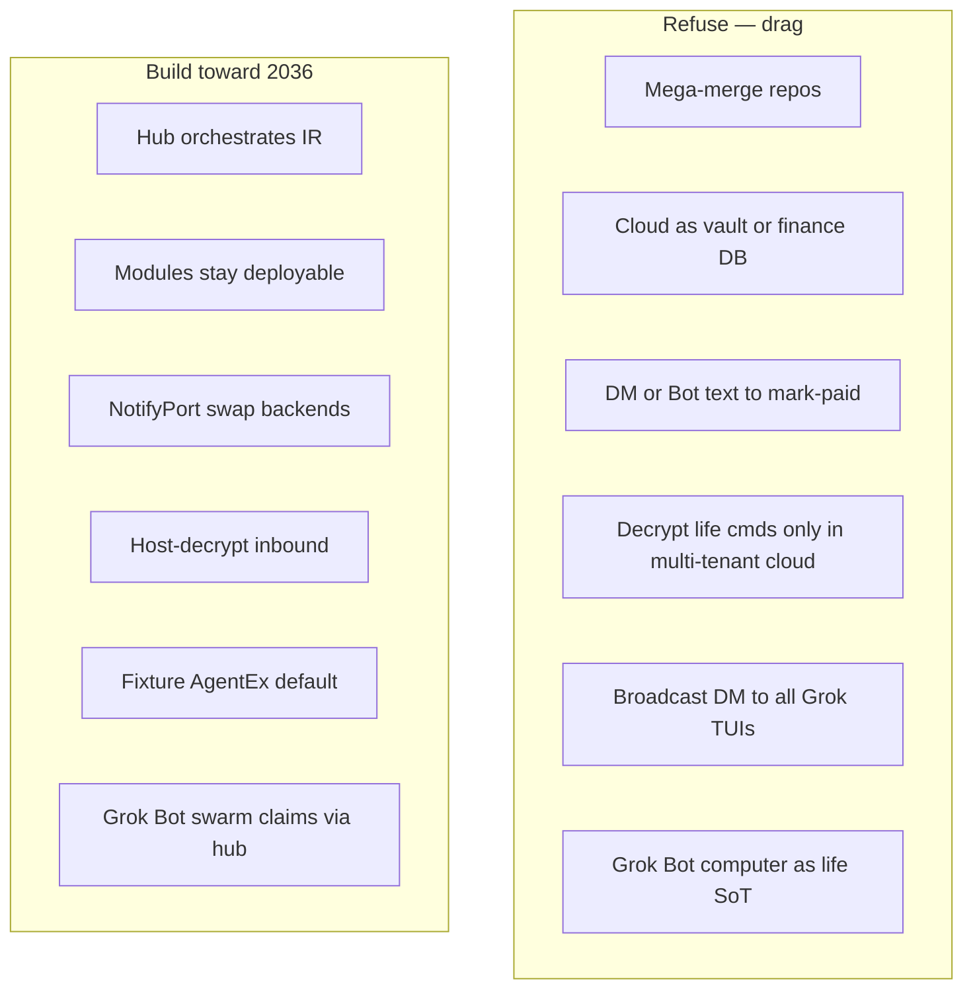

| Risk | Guard | Status |
|------|-------|--------|
| Dual-write wealth/premflow | Single-writer + allow-listed cues | Law written; bridge unbuilt |
| Unattended bank/email | HITL + dry-run default; **no bank connector on Bot VM** | Shipped digital-flow pattern |
| Channel sprawl | One NotifyPort IR | Spec in SN-HUB-2 |
| Inbound routing chaos | Session registry + verbs | groxy doc sketch; not shipped |
| Bot swarm without hub | All Bot work ends in hub propose/HITL or redacted MCP | SN-HUB-7 |
| Scope cosplay | Park list + energy lock | This doc §8 |

---

## 7. Blueprint cards — next work

### SN-HUB-1 · Lived-path gate (no new code)

**Problem:** Without a lived primary path, bridge cards are theater.

**Operator lock (2026-08-12):** priority order **2 → 3 → 1** — wealth CLI/brief first, then outbound nudge, then ensembly turn/runtime.

| Step | Pass if |
|------|---------|
| Primary: wealth-core board/brief (fixtures + real via path-map when ready) | Used ≥5 days in window; no dual-write experiments |
| Next: outbound redacted nudge via groxy (may overlap light) | At least one trusted non-finance inject |
| Then: ensembly `swarm turn` / `peram runtime` daily habit | ≥5 days after wealth primary stable |
| Confirm park list still park | No surprise feature PRs on D4 |

**Verify:** Operator statement + practice notes in life-os session or `private/clone/`.

---

### SN-HUB-2 · NotifyPort IR + groxy outbound

**Problem:** ensembly digests and arch-machine jobs notify through ad-hoc paths; no shared redaction contract.

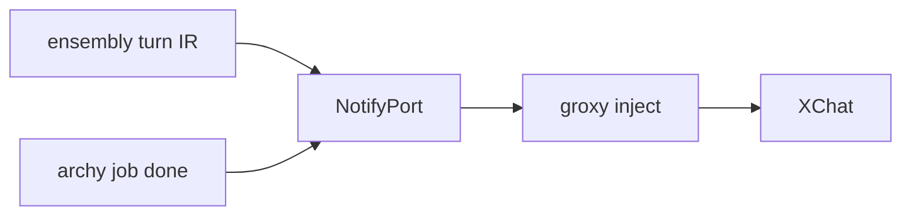

| File / surface | Work |
|----------------|------|
| `ensembly/docs/` or `src/notify/` | Schema v0: `kind`, `redacted_body`, `gate_ids[]`, `dry_run`. Production round-trip should add `schema_version`, `event_id` / idempotency, `source`, `severity`, `expires_at`, `correlation_id` |
| Privacy classifier | All outbound through classify; reject matrix for finance/path/vault plaintext |
| `~/arch-machine` groxy | First backend; ensembly CLI calls inject or shared bin. Full “port” only when a second producer needs the same contract |

**Done when:** One command from ensembly posts a **redacted** turn nudge via groxy; fixture test rejects finance plaintext.

**Verify:** `npm test` (or new notify test) + live inject with `GROXY_ALLOW_SELF=1` on non-sensitive digests only.

---

### SN-HUB-3 · Wealth brief → HITL (dry-run)

**Problem:** Money math lives in wealth-core; day hub cannot gate dues without dual SoT thrash.

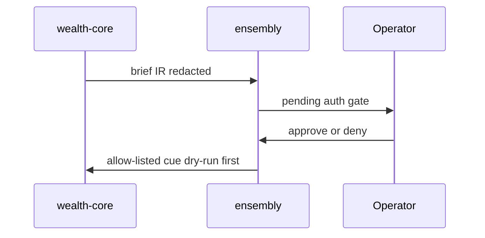

| File / surface | Work |
|----------------|------|
| wealth-core API / CLI brief | Stable JSON brief contract |
| ensembly digital-flow or runtime | Import brief as pending gates |
| Tests | Fixtures only in CI; no real ledger in git |

**Done when:** Fixture brief creates pending gate; approve runs dry-run cue; deny no-ops; live path behind explicit flag + HITL.

**Verify:** wealth-core fixture tests + ensembly HITL tests green.

---

### SN-HUB-4 · XChat inbound verbs (host-decrypt)

**Problem:** Phone cannot approve/deny without laptop CLI; legacy groxy “no inbound” blocked on old transport — Activity + chat-xdk reopen a **different** path.

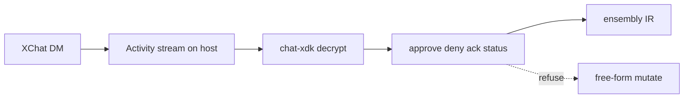

| File / surface | Work |
|----------------|------|
| groxy or ensembly channel ingest | Local stream client; keys on host |
| Verb grammar | Allow-list only |
| Registry | Optional `!alias` → ACP later (after verbs) |

**Done when:** Operator can `approve <gateId>` from XChat; hub **resolves the gate in ensembly IR (single writer)**; modules receive allow-listed cues only after that hub event; unknown verbs refuse loudly; no ledger write from free text. (Not “dual-write” — chat never owns pending state.)

**Verify:** Fixture ciphertext/verb table tests; idempotent re-approve no-ops; manual live check on a non-finance gate first.

---

### SN-HUB-5 · peram-vault T2 bridge (parked until seal pain)

**Problem:** High-sens blobs need PQ seal path named in DECISIONS without reinventing crypto in the game loop.

**Energy:** **Off active sprint** until a concrete seal need (not “because DECISIONS named it”). Footnote only on near gantt.

**Done when:** ensembly can seal/status against peram-vault law with fixtures; Eve never sees plaintext.

**Verify:** peram-vault live smoke + ensembly bridge smoke.

---

### SN-HUB-6 · Eve cockpit behind NotifyPort (footnote / later)

**Problem:** Remote approve UX may outgrow chat verbs; Eve remains optional bridge per EVE-FIT.

**Energy:** **Not on critical path** until XChat verbs (SN-HUB-4) are lived ≥2 weeks. Same NotifyPort schema only — never a parallel human inbox.

**Done when:** Same NotifyPort schema posts to Eve channel; privacy checklist green; pending gates still authoritative only in ensembly.

**Verify:** Per EVE-FIT done-when — after SN-HUB-2 stable **and** SN-HUB-4 lived.

---

### SN-HUB-7 · Grok Bot swarm bind (x.ai)

**Problem:** Named Grok Bots can already parallelize digital work — but without hub IR they become a second life runtime (and share one cloud computer).

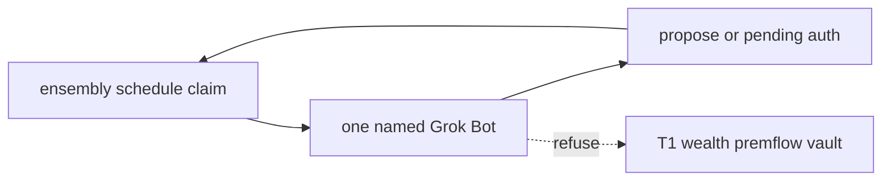

| File / surface | Work |
|----------------|------|
| ensembly runtime / clone ledger | v1: **one** named Bot → one digital chore class |
| MCP / redacted tools | Bot calls hub read + propose; mutate only via HITL gates; redaction on Bot-facing tools too |
| Privacy + connector policy | No vault/bank/email unattended on shared Bot computer |
| Docs | Fit note: Bot = swarm worker; ensembly = ship computer |

**Adopt (v1):** one Bot, digital chore → hub-visible propose.  
**Adopt (later):** multi-bot handoffs/routines only after v1 claim is daily and hub habit exists.  
**Adapt:** Bot routines fire only after hub-compatible propose/HITL.  
**Refuse:** Bot VM as day/T1/wealth/premflow SoT; unattended finance/email; full persona upload; Bot chat as approval ledger.

**Done when:** At least one named Bot completes a digital chore and lands a **hub-visible** propose or pending gate (fixture or live); no direct ledger write from Bot; operator denies from turn (XChat verb only if SN-HUB-4 already live).

**Verify:** Privacy checklist; dry-run path; no multi-bot handoff required for v1.

---

## 8. Scope lock (operator decisions)

| Decision | Lock |
|----------|------|
| Shape | **A — hub-not-absorb** + cloud-deployable modules |
| **Swarm** | **Grok Bots (x.ai) = outer swarm workers**; local HOOTL = inner; hub owns claim/HITL graph |
| Safety | Fixture-first AgentEx; dry-run default; single-writer SoTs; finance/dates hard |
| Channel v1 | **XChat via groxy** (outbound first); Eve later behind same IR |
| Inbound | **Host-decrypt + verb-first** — not cloud-only decrypt; not free-form life mutate |
| arch-machine | Host plane; **reuse groxy**; practice/maintenance energy only |
| Park | thepulimaangani, shelf-life, adaptate, elomaxz, ask-grok, grokplans, testskills, latex-cv deep work |
| Archive | Only with explicit operator list |

### Pain-order vs build-order (do not conflate)

Two schedules. Agents that merge them invent parallel tracks.

**A — Pain-order (operator energy, locked 2026-08-12 as 2 → 3 → 1)**

| Rank | Choice | Human energy | During this phase |
|------|--------|--------------|-------------------|
| **1st** | **2** — wealth | wealth-core board/brief daily | **SN-HUB-1 only.** Zero bridge *feature* code. Optional 30s ensembly `turn` / `runtime status` as **status glance** only. Optional one non-finance light `groxy inject` (not a project). |
| **2nd** | **3** — outbound nudge | Trust redacted digests via groxy | Practice inject; **SN-HUB-2 feature work** still closed until wealth primary living **and** (when building) after SN-HUB-3 dry-run trusted per build-order |
| **3rd** | **1** — ensembly hub | Daily turn / runtime habit | Hub becomes ship computer; opens path to inbound verbs + Bot IR bind |

**B — Build-order (bridge cards after SN-HUB-1 pass — serialize)**

| Step | Card | Opens when | Note |
|------|------|------------|------|
| 0 | SN-HUB-1 | Now | No new code; practice gate |
| 1 | SN-HUB-3 | Wealth primary living ≥5 days | Wealth brief → HITL dry-run |
| 2 | SN-HUB-2 | SN-HUB-3 dry-run trusted | NotifyPort + groxy outbound (v0 may be thin inject + reject tests; full port when 2nd producer needs it) |
| 3 | Hub habit | Outbound nudge trusted | Daily ensembly turn/runtime — not kernel stretch tourism |
| 4 | SN-HUB-4 | Hub habit started + outbound trusted | XChat inbound verbs |
| 5 | SN-HUB-7 | Hub habit exists | **One** Bot propose-only; handoffs later |
| — | SN-HUB-5 / SN-HUB-6 | Concrete seal pain / XChat verbs lived | Parked off critical path |

| Rank | Choice | Meaning | Bridge card when ready |
|------|--------|---------|------------------------|
| **1st** | **2** — wealth | wealth-core CLI / brief as daily practice; finance pain first | → **SN-HUB-3** (after practice) |
| **2nd** | **3** — outbound nudge | `groxy inject` + redacted digest | → **SN-HUB-2** (after SN-HUB-3 trusted) |
| **3rd** | **1** — ensembly hub | daily turn / runtime habit | kernel [coming-next](coming-next.md) + hub daily practice |

Serialize: do not start SN-HUB-2 **feature** work until wealth primary is living; do not parallelize SN-HUB-2 with SN-HUB-3; do not deep-dive ensembly stretch until nudge is trusted. Light inject during wealth primary OK. **One human inbox:** pending gates authoritative only in ensembly — XChat/Eve/Bot never hold a second pending store.

---

## 9. Gantt — sprint order

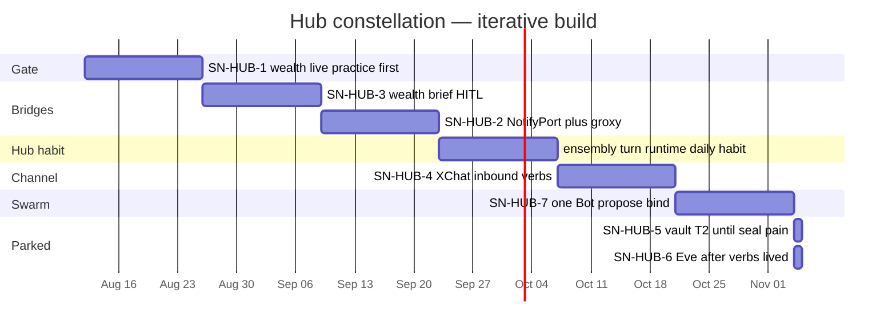

**Rule:** **Pain:** wealth practice → light/outbound nudge → ensembly habit. **Build after practice:** SN-HUB-3 → SN-HUB-2 → hub habit → SN-HUB-4 → SN-HUB-7 (one Bot). Do not parallelize SN-HUB-2 with SN-HUB-3. Bots may be *used* manually earlier; **IR bind** waits until hub habit exists. Eve + vault T2 stay parked.

---

## 10. Monitoring signals

| Signal | Healthy | Sick |
|--------|---------|------|
| Energy | One primary logged | Three “almost” projects |
| Live use | Turn or wealth CLI used ≥5×/week | Docs-only progress |
| Data safety | Zero dual-write incidents; dry-run default | Chat/agent wrote ledger |
| Bridge | One NotifyPort backend | Ad-hoc DMs from three scripts |
| Swarm | Bots propose into hub; HITL on mutate | Bot writes ledger / skips hub |
| Park | D4 quiet | Surprise PRs on parked craft |

---

## 11. Done log (constellation session)

| Date | What |
|------|------|
| 2026-08-12 | EVA: A hub-not-absorb + flex cloud/DevEx/safety |
| 2026-08-12 | Distance map for `~/Work/personal` + life-os |
| 2026-08-12 | XChat adopt for nudge; inbound redesign (host-decrypt, verbs) |
| 2026-08-12 | arch-machine: groxy = NotifyPort candidate; keeper ≠ peram-vault |
| 2026-08-12 | This spacemap created |
| 2026-08-12 | Priority lock: **2 → 3 → 1** (wealth → outbound nudge → ensembly turn) |
| 2026-08-12 | **Grok Bot (x.ai) added as outer swarm layer** — SN-HUB-7; not life SoT |
| 2026-08-12 | Second-opinion + deep-research: **pain-order vs build-order** split; one human inbox; SN-HUB-4 single-writer wording; SN-HUB-5/6 off critical path; SN-HUB-7 v1 = one Bot; DECISIONS + clone ledger aligned |

Kernel/game done log remains in [coming-next.md](coming-next.md) §11.

---

## 12. File touch mindmap

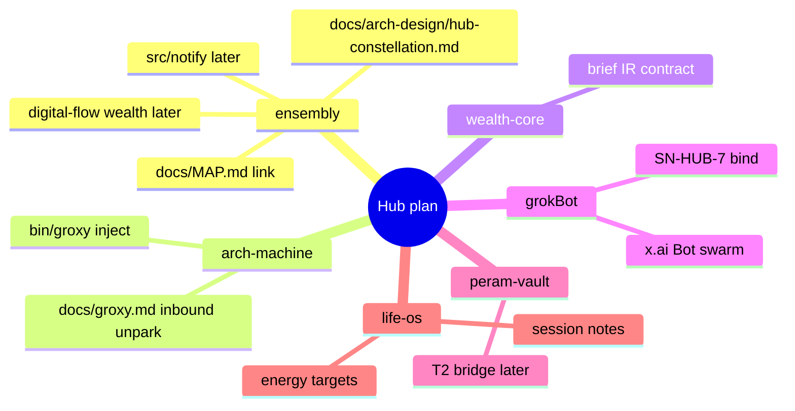

---

## 13. References

| Source | Use |
|--------|-----|
| [LIFE-OS-BOUNDARY.md](../LIFE-OS-BOUNDARY.md) | Memory ≠ runtime |
| [PREMFLOW-FIT.md](../PREMFLOW-FIT.md) | Shared capture SoT |
| [CLONE-COPILOT.md](../CLONE-COPILOT.md) | Portfolio PRs |
| [EVE-FIT.md](../EVE-FIT.md) | Cloud bridge adopt/refuse |
| [DECISIONS.md](../DECISIONS.md) | T1/T2, Eve, premflow, wealth |
| [coming-next.md](coming-next.md) | ensembly kernel/game SN cards |
| [PRIVACY.md](../PRIVACY.md) | Push / redaction |
| [Grok Bot overview](https://docs.x.ai/grok-bot/overview) | Named bots, shared computer, handoffs, routines |
| `~/arch-machine/docs/groxy.md` | Outbound inject; inbound design sketch |
| `~/Work/personal/wealth-core` | Money math SoT |
| collab-finder blueprint style | SN cards / gantt / done-when |

---

**Footer plain rule:** Hub schedules the swarm; Grok Bots work the digital chores; modules own the bytes — never let a Bot computer become the life SoT.
